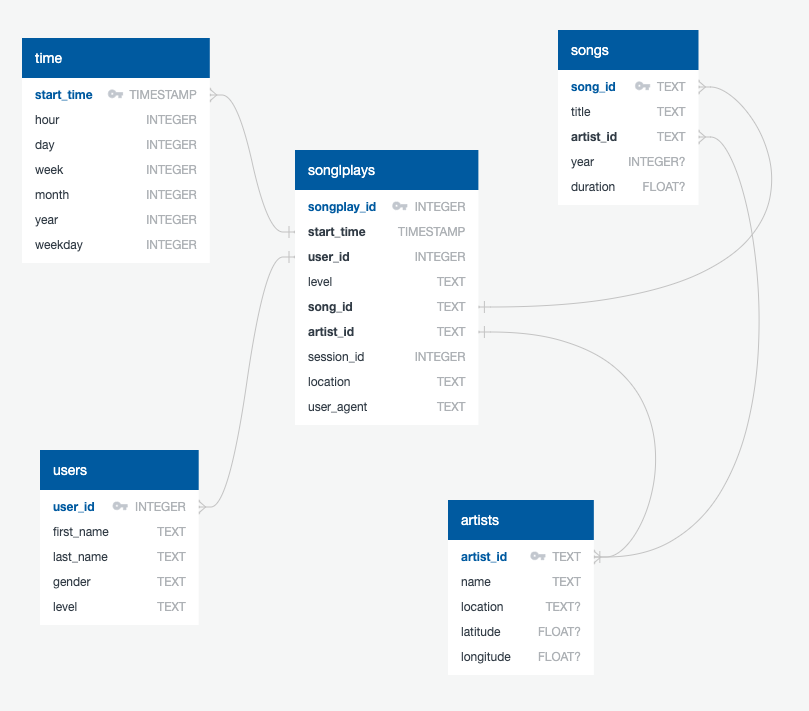

# Project 5: Data Pipelines
This is the code for the fith project of the [Udacity Data Engineering Nanodegree](https://www.udacity.com/course/data-engineer-nanodegree--nd027).

## Project Description
### Introduction
A music streaming company called Sparkify has decided that it is time to introduce more automation and monitoring to their data warehouse ETL pipelines and come to the conclusion that the best tool to achieve this is Apache Airflow.

The source data resides in S3 and needs to be processed in Sparkify's data warehouse in Amazon Redshift. The source datasets consist of JSON logs that tell about user activity in the application and JSON metadata about the songs the users listen to.

### ETL Pipeline
The pipeline extracts the song and log datasets in JSON format from S3 into staging tables in order to create a set of analytics tables in a star schema in Redshift.

### Schema Design
We created a star schema optimized for queries on song play analysis using the provided datasets. This includes the following tables.

#### Fact Table
1. **songplays** - records in log data associated with song plays i.e. records with page `NextSong`
    + songplay_id, start_time, user_id, level, song_id, artist_id, session_id, location, user_agent

#### Dimension Tables
1. **users** - users in the app
    + user_id, first_name, last_name, gender, level

2. **songs** - songs in music database
    + song_id, title, artist_id, year, duration

3. **artists** - artists in music database
    + artist_id, name, location, latitude, longitude

4. **time** - timestamps of records in songplays broken down into specific units
    + start_time, hour, day, week, month, year, weekday

## Dependencies
Make sure you have already installed both [Docker Engine](https://docs.docker.com/engine/install/) and [Docker Compose](https://docs.docker.com/compose/install/). You don't need to install PostgreSQL or Apache Airflow yourself, as everithing is provided by the Docker images.

## Setup
### Local Mode
From the project directory, start up the application by running `docker-compose up -d`. Then, access the Airflow web interface by pointing your browser to `http://localhost:8080`.

### AWS Mode
You need a Redshift cluster up and running and an IAM role with `AmazonS3ReadOnlyAccess` permission attached to it in order for your cluster to load data from Amazon S3 buckets.

Get your cluster and role configuration from the AWS console and fill in the `services/airflow-webserver/config/etl.cfg` file.

From the project directory, start up the application by running `docker-compose up -d`. Then, access the Airflow web interface by pointing your browser to `http://localhost:8080`.

## Usage
### Local Mode
In this mode the pipeline executes locally. The Airflow service loads the dataset from the `data/` directory and interacts with a local PostgreSQL container.

In the Airflow web UI turn on the DAG called `etl_local_postgres` and click the `Trigger DAG` button. Once the pipeline is done you can inspect the resulting tables visiting `http://localhost:9090` in your web browser.

### AWS Mode
In this mode the pipeline uses cloud resources. The Airflow service loads the dataset from S3 and interacts with a remote Redshift cluster.

In the Airflow web UI turn on the DAG called `etl_s3_redshift`. The process should start automatically and is scheduled to run once an hour. After the pipeline is done you can inspect the resulting tables checking your [Redshift console](https://console.aws.amazon.com/redshift).
